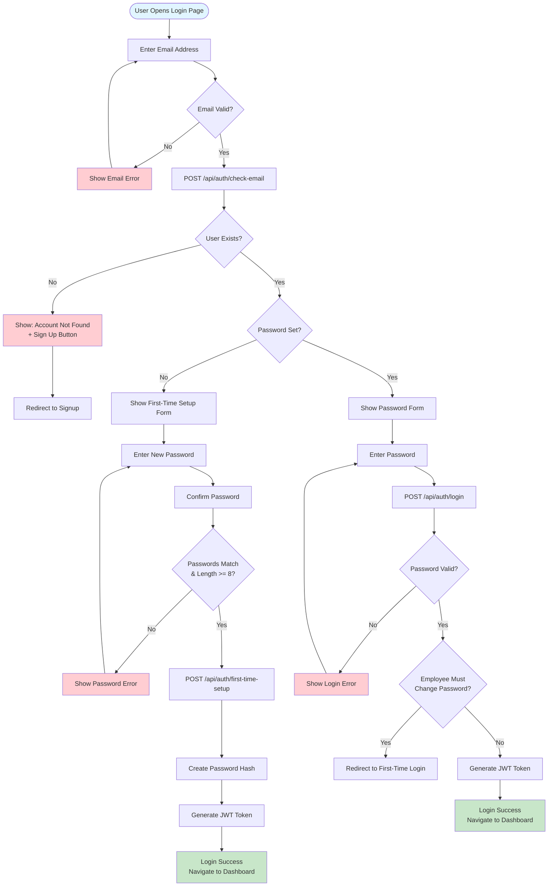
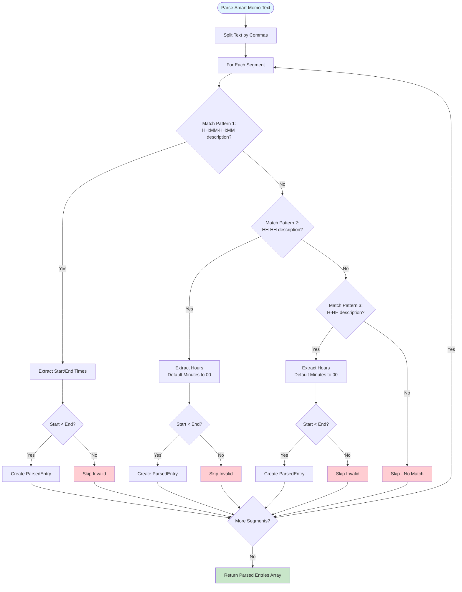
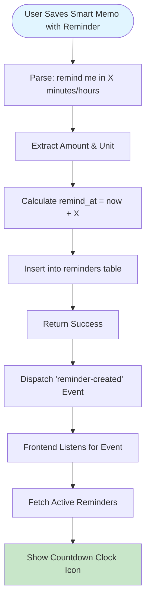
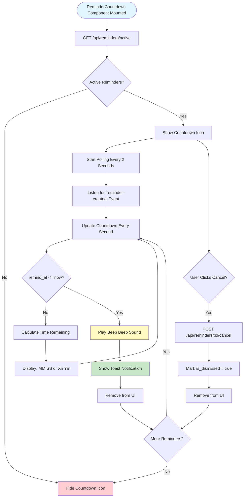
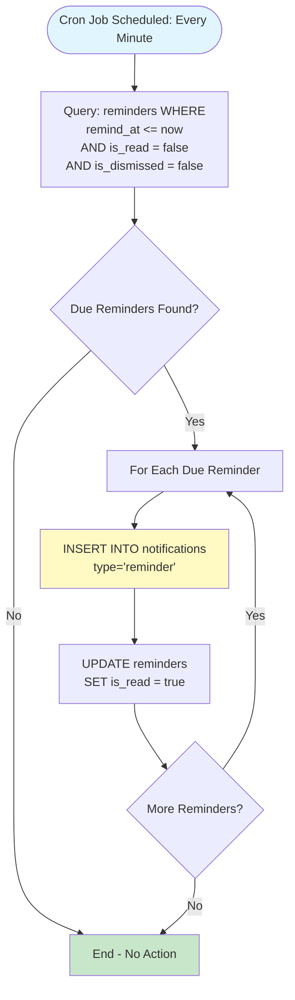
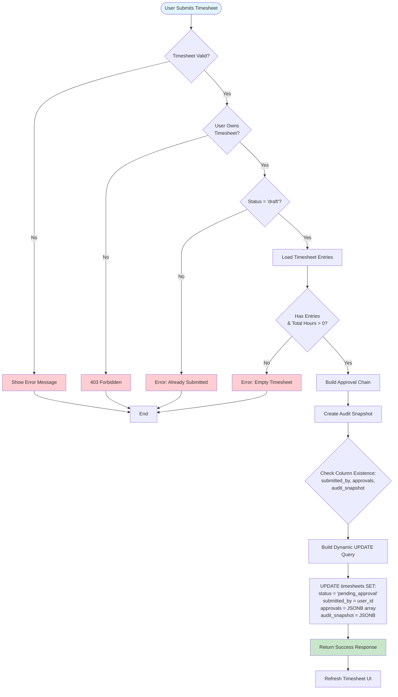
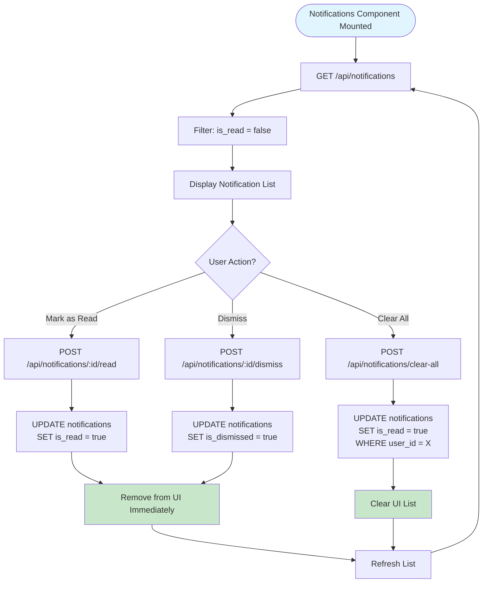
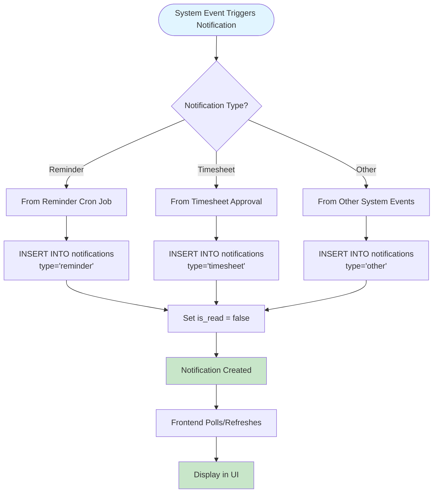
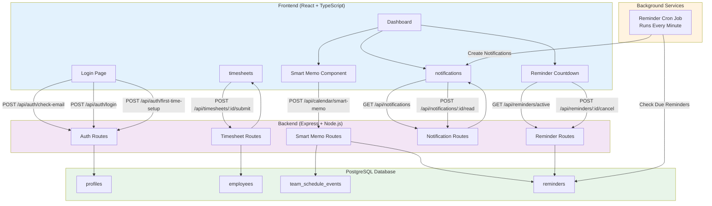

# HR Platform - System Flowcharts

This document contains detailed flowcharts for all major features of the HR Platform.

## Table of Contents
1. [Two-Step Email-First Login Flow](#1-two-step-email-first-login-flow)
2. [Smart Memo Processing Flow](#2-smart-memo-processing-flow)
3. [Reminder System Flow](#3-reminder-system-flow)
4. [Timesheet Submission Flow](#4-timesheet-submission-flow)
5. [Notification System Flow](#5-notification-system-flow)

---

## 1. Two-Step Email-First Login Flow

---

## 2. Smart Memo Processing Flow

```mermaid
flowchart TD
    Start([User Enters Smart Memo Text]) --> InputText[Textarea Input:<br/>11-12 in meeting, 13-15 worked on issues<br/>remind me in 30 minutes]
    InputText --> PreviewClick{User Clicks<br/>Preview?}
    PreviewClick -->|Yes| ParseText[Parse Smart Memo Text]
    PreviewClick -->|No| SaveClick{User Clicks<br/>Save to Calendar?}
    
    ParseText --> ExtractReminders[Extract Reminder Commands]
    ExtractReminders --> ParseTimeRanges[Parse Time Ranges]
    ParseTimeRanges --> ValidateEntries{Valid Entries<br/>Found?}
    ValidateEntries -->|No| ShowError[Show Error:<br/>No valid entries]
    ShowError --> InputText
    ValidateEntries -->|Yes| ShowPreview[Show Preview Dialog<br/>with Parsed Entries]
    ShowPreview --> ConfirmSave{User Confirms<br/>Save?}
    ConfirmSave -->|No| InputText
    ConfirmSave -->|Yes| SaveClick
    
    SaveClick -->|Yes| ParseText2[Parse Smart Memo Text]
    ParseText2 --> ExtractReminders2[Extract Reminder Commands]
    ExtractReminders2 --> ParseTimeRanges2[Parse Time Ranges]
    ParseTimeRanges2 --> ValidateEntries2{Valid Entries<br/>or Reminders?}
    ValidateEntries2 -->|No| ShowError2[Show Error]
    ShowError2 --> InputText
    ValidateEntries2 -->|Yes| APICall[POST /api/calendar/smart-memo]
    
    APICall --> GetTenant[Get Tenant ID]
    GetTenant --> GetEmployee[Get Employee ID]
    GetEmployee --> EnsureTables[Ensure Tables Exist:<br/>team_schedule_events, reminders]
    EnsureTables --> SetupRLS[Setup Row Level Security]
    
    SetupRLS --> ProcessEntries{Has Calendar<br/>Entries?}
    ProcessEntries -->|Yes| LoopEntries[For Each Entry]
    LoopEntries --> CreateEvent[Insert into team_schedule_events<br/>with RLS]
    CreateEvent --> NextEntry{More Entries?}
    NextEntry -->|Yes| LoopEntries
    NextEntry -->|No| ProcessReminders
    
    ProcessEntries -->|No| ProcessReminders{Has Reminders?}
    ProcessReminders -->|Yes| LoopReminders[For Each Reminder]
    LoopReminders --> CreateReminder[Insert into reminders table]
    CreateReminder --> NextReminder{More Reminders?}
    NextReminder -->|Yes| LoopReminders
    NextReminder -->|No| ReturnSuccess
    
    ProcessReminders -->|No| ReturnSuccess[Return Success Response]
    ReturnSuccess --> DispatchEvent[Dispatch 'reminder-created' Event]
    DispatchEvent --> ShowToast[Show Success Toast]
    ShowToast --> ClearInput[Clear Textarea]
    ClearInput --> RefreshCalendar[Refresh Calendar View]
    
    style Start fill:#e1f5ff
    style ReturnSuccess fill:#c8e6c9
    style ShowError fill:#ffcdd2
    style ShowError2 fill:#ffcdd2
    style CreateEvent fill:#fff9c4
    style CreateReminder fill:#fff9c4
```

### Smart Memo Parsing Logic

---

## 3. Reminder System Flow

### 3.1 Reminder Creation Flow

### 3.2 Reminder Countdown & Notification Flow

### 3.3 Reminder Cron Job Flow

---

## 4. Timesheet Submission Flow

---

## 5. Notification System Flow

### 5.1 Notification Display Flow

### 5.2 Notification Creation Flow

---

## 6. Complete System Architecture Flow

---

## Notes

- **RLS (Row Level Security)**: All queries to `team_schedule_events` respect tenant isolation through RLS policies
- **Dynamic Column Handling**: Timesheet submission dynamically checks for column existence before using them
- **Real-time Updates**: Reminder countdown uses custom events and polling for instant UI updates
- **Error Handling**: All flows include comprehensive error handling and user feedback
- **Security**: All API endpoints require authentication tokens and tenant context validation

