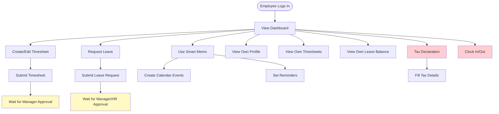
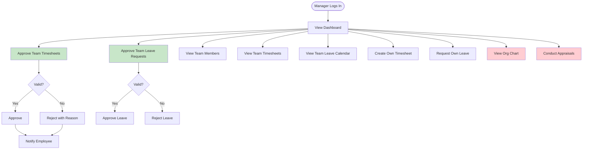
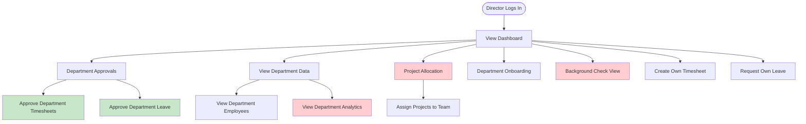
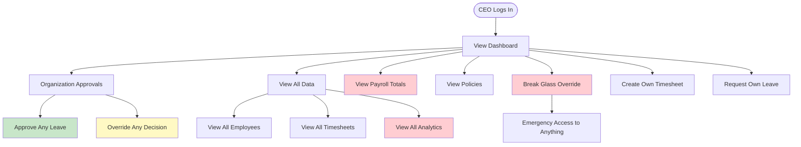
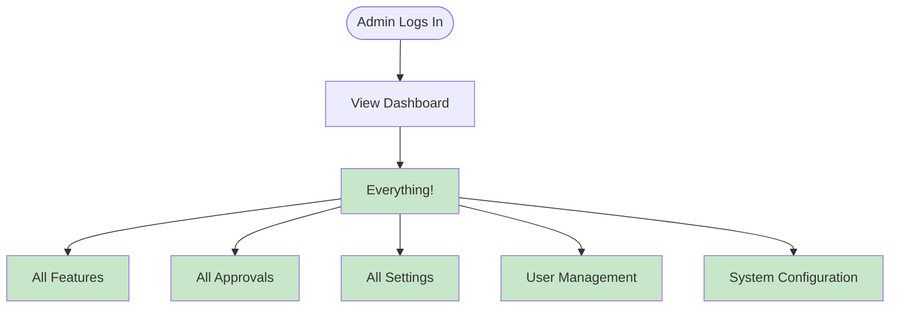
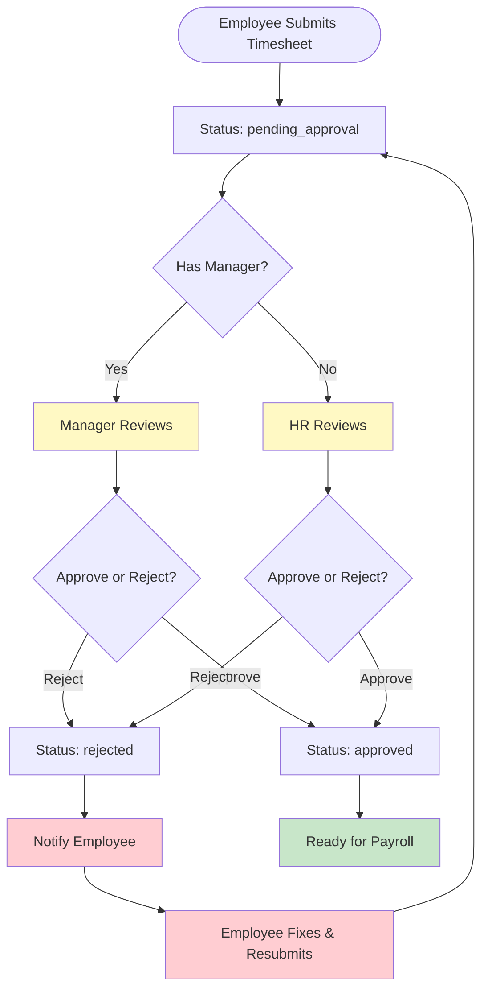
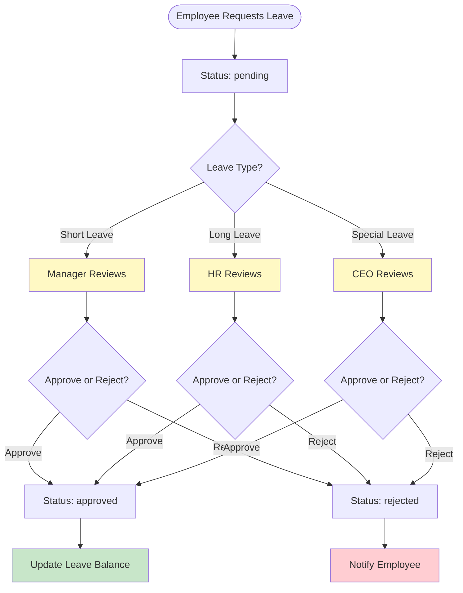
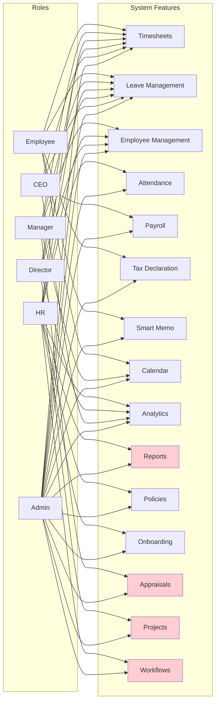

# HR Platform - User Roles & Approval Flowcharts

## Overview
This document shows what each user role can do and how approvals flow through the system. **Red text indicates missing features or bottlenecks** that need work.

---

## User Roles Hierarchy

```
┌─────────────┐
│   Admin     │ ← Full access to everything
└──────┬──────┘
       │
       ▼
┌─────────────┐
│    CEO      │ ← Organization-wide approvals
└──────┬──────┘
       │
       ▼
┌─────────────┐
│  Director   │ ← Department-wide approvals
└──────┬──────┘
       │
       ▼
┌─────────────┐
│     HR      │ ← HR operations & approvals
└──────┬──────┘
       │
       ▼
┌─────────────┐
│  Manager    │ ← Team approvals
└──────┬──────┘
       │
       ▼
┌─────────────┐
│  Employee   │ ← Basic user
└─────────────┘
```

---

## 1. Employee Role - What They Can Do



**Employee Capabilities:**
- ✅ Create & submit timesheets
- ✅ Request leave
- ✅ Use Smart Memo
- ✅ View own profile & data
- ✅ Tax declaration
- ⚠️ **Clock In/Out** - *May need verification*
- ⚠️ **View team calendar** - *Limited access*

---

## 2. Manager Role - What They Can Do



**Manager Capabilities:**
- ✅ Approve team timesheets
- ✅ Approve team leave requests
- ✅ View team data
- ✅ Create own timesheets/leave
- ⚠️ **Appraisals** - *May need verification*
- ⚠️ **Team performance metrics** - *May be missing*

---

## 3. HR Role - What They Can Do

```mermaid
flowchart TD
    Start([HR Logs In]) --> Dashboard[View Dashboard]
    
    Dashboard --> ManageEmp[Manage Employees]
    ManageEmp --> AddEmp[Add New Employee]
    ManageEmp --> EditEmp[Edit Employee]
    ManageEmp --> Terminate[Terminate Employee]
    
    Dashboard --> ApproveAll[Approve Any Timesheet]
    ApproveAll --> OverrideTS[Override Manager Decision]
    
    Dashboard --> ApproveLeaveHR[Approve Any Leave]
    ApproveLeaveHR --> OverrideLeave[Override Leave Decision]
    
    Dashboard --> Onboarding[Manage Onboarding]
    Dashboard --> Policies[Create/Edit Policies]
    Dashboard --> Holidays[Manage Holidays]
    Dashboard --> Shifts[Manage Shifts]
    
    Dashboard --> UploadAtt[Upload Attendance]
    Dashboard --> Analytics[View Analytics]
    Dashboard --> Reports[Generate Reports]
    
    Dashboard --> Workflows[Manage Workflows]
    Dashboard --> AuditLogs[View Audit Logs]
    
    style OverrideTS fill:#fff9c4
    style OverrideLeave fill:#fff9c4
    style Workflows fill:#ffcdd2
    style AuditLogs fill:#ffcdd2
    style Reports fill:#ffcdd2
```



**HR Capabilities:**
- ✅ Full employee management
- ✅ Approve any timesheet/leave
- ✅ Override manager decisions
- ✅ Manage policies & holidays
- ✅ Upload attendance
- ⚠️ **Workflows** - *May need verification*
- ⚠️ **Audit Logs** - *May need verification*
- ⚠️ **Advanced Reports** - *May be missing*

---

## 4. Director Role - What They Can Do



**Director Capabilities:**
- ✅ Department-wide approvals
- ✅ View department data
- ✅ Project allocation
- ⚠️ **Department Analytics** - *May be missing*
- ⚠️ **Background Check View** - *May need verification*

---

## 5. CEO Role - What They Can Do



**CEO Capabilities:**
- ✅ Organization-wide approvals
- ✅ View all data
- ✅ Override any decision
- ⚠️ **Break Glass Override** - *May need implementation*
- ⚠️ **Payroll Totals View** - *May need verification*
- ⚠️ **Organization Analytics** - *May be missing*

---

## 6. Admin Role - What They Can Do



**Admin Capabilities:**
- ✅ **Full access to everything**
- ✅ All features
- ✅ All approvals
- ✅ System configuration
- ✅ User management

---

## 7. Timesheet Approval Flow



**Bottlenecks Identified:**
- ⚠️ **No automatic notification to manager** - *Red*
- ⚠️ **No escalation if manager doesn't approve** - *Red*
- ⚠️ **No multi-level approval** - *Red*
- ⚠️ **No deadline reminders** - *Red*

---

## 8. Leave Approval Flow



**Bottlenecks Identified:**
- ⚠️ **No automatic leave balance check** - *Red*
- ⚠️ **No conflict detection (overlapping leaves)** - *Red*
- ⚠️ **No team coverage check** - *Red*
- ⚠️ **No automatic calendar blocking** - *Red*

---

## 9. Complete System Features by Role



---

## 10. Approval Bottlenecks & Missing Features

### Timesheet Approval Bottlenecks

```
┌─────────────────────────────────────────┐
│  Timesheet Approval Issues              │
├─────────────────────────────────────────┤
│  ❌ No automatic notification           │
│  ❌ No escalation mechanism             │
│  ❌ No deadline reminders                │
│  ❌ No multi-level approval              │
│  ❌ No approval history                  │
│  ❌ No bulk approval                     │
│  ❌ No approval dashboard                │
└─────────────────────────────────────────┘
```

### Leave Approval Bottlenecks

```
┌─────────────────────────────────────────┐
│  Leave Approval Issues                  │
├─────────────────────────────────────────┤
│  ❌ No automatic balance check          │
│  ❌ No conflict detection                │
│  ❌ No team coverage check               │
│  ❌ No calendar auto-block               │
│  ❌ No delegation support                │
│  ❌ No leave calendar view                │
└─────────────────────────────────────────┘
```

### Missing Features by Role

```
┌─────────────────────────────────────────┐
│  Employee Missing Features              │
├─────────────────────────────────────────┤
│  ❌ Team calendar view (limited)        │
│  ❌ Clock in/out verification            │
│  ❌ Expense reimbursement                │
│  ❌ Performance self-review              │
└─────────────────────────────────────────┘

┌─────────────────────────────────────────┐
│  Manager Missing Features               │
├─────────────────────────────────────────┤
│  ❌ Team performance dashboard          │
│  ❌ Appraisal workflow                  │
│  ❌ Team analytics                      │
│  ❌ Approval delegation                 │
└─────────────────────────────────────────┘

┌─────────────────────────────────────────┐
│  HR Missing Features                    │
├─────────────────────────────────────────┤
│  ❌ Advanced reporting                  │
│  ❌ Workflow automation                 │
│  ❌ Audit log viewer                    │
│  ❌ Compliance tracking                 │
└─────────────────────────────────────────┘

┌─────────────────────────────────────────┐
│  Director/CEO Missing Features         │
├─────────────────────────────────────────┤
│  ❌ Department/Org analytics           │
│  ❌ Executive dashboard                 │
│  ❌ Strategic reports                   │
│  ❌ Break glass override                │
└─────────────────────────────────────────┘
```

---

## 11. Simple Approval Flow Summary

```
Employee Action → Submit → Pending Approval
                      │
                      ▼
              ┌───────────────┐
              │ Who Approves? │
              └───────┬───────┘
                      │
        ┌─────────────┼─────────────┐
        │             │             │
        ▼             ▼             ▼
    Manager         HR            CEO
    (Team)      (Override)    (Org-wide)
        │             │             │
        └─────────────┼─────────────┘
                      │
                      ▼
              ┌───────────────┐
              │ Approved or   │
              │   Rejected    │
              └───────┬───────┘
                      │
        ┌─────────────┼─────────────┐
        │             │             │
        ▼             ▼             ▼
    Approved      Rejected      Notify
        │             │         Employee
        │             │             │
        ▼             ▼             ▼
    Process      Fix &        Resubmit
    (Payroll)    Resubmit
```

---

## 12. Quick Reference - Who Can Approve What?

| Action | Employee | Manager | HR | Director | CEO | Admin |
|--------|----------|---------|----|----------|----|----|
| Own Timesheet | Submit | - | Approve | Approve | Approve | Approve |
| Team Timesheet | - | Approve | Override | Override | Override | Approve |
| Own Leave | Request | - | Approve | Approve | Approve | Approve |
| Team Leave | - | Approve | Override | Override | Override | Approve |
| Add Employee | - | - | ✅ | - | - | ✅ |
| Edit Employee | Own | - | ✅ | Dept | - | ✅ |
| View Analytics | Own | Team | All | Dept | All | All |
| Manage Policies | - | - | ✅ | View | View | ✅ |

**Legend:**
- ✅ = Full access
- View = Read-only
- - = No access

---

## Recommendations for Enhancement

### Priority 1 (Critical Bottlenecks)
1. **Automatic Notifications** - Notify approvers when items pending
2. **Approval Deadlines** - Set deadlines with reminders
3. **Escalation** - Auto-escalate if not approved in time
4. **Approval Dashboard** - Central view of all pending approvals

### Priority 2 (Missing Features)
1. **Multi-level Approval** - Support multiple approval stages
2. **Delegation** - Allow approvers to delegate
3. **Bulk Operations** - Approve/reject multiple items
4. **Approval History** - Track all approval actions

### Priority 3 (Enhancements)
1. **Analytics Dashboards** - Role-specific analytics
2. **Advanced Reports** - Custom report generation
3. **Workflow Automation** - Automated approval workflows
4. **Mobile Notifications** - Push notifications for approvals

---

**Last Updated**: December 2025  
**Status**: Active Development


